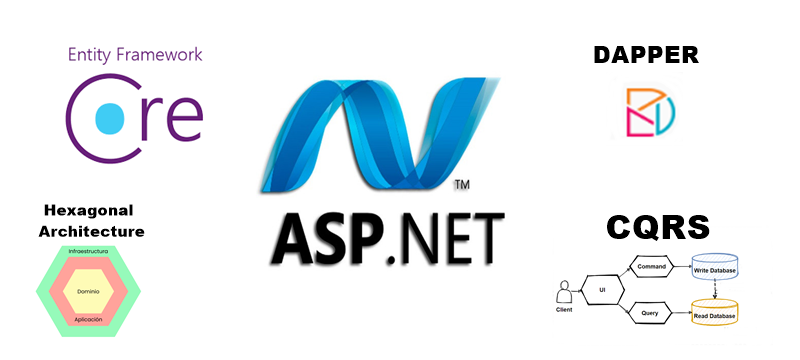
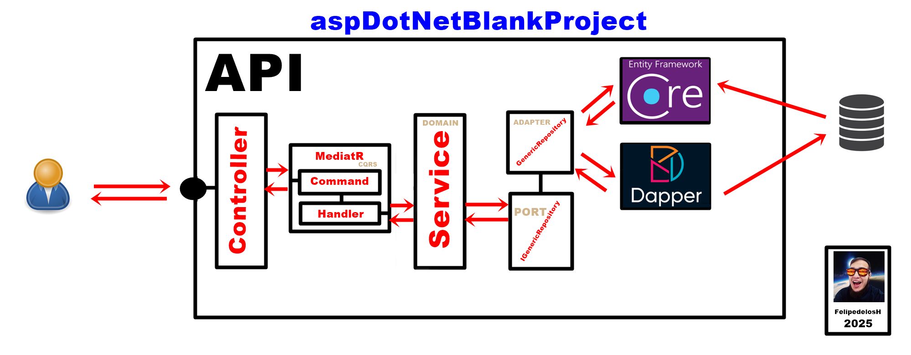

<h1 align="center"> FelipedelosH </h1>
 
<h4>aspDotNetBlankProject</h4>

:construction: In construction :construction:
  
This project is an implementation of a **Hexagonal Architecture** using **CQRS (Command Query Responsibility Segregation)** in **ASP.NET Core**. The architecture is divided into three main layers:

- **Domain**: Contains business logic, domain entities, and service interfaces.
- **Application**: Implements use cases using the CQRS pattern with **MediatR**, including commands and queries.
- **Infrastructure**: Handles database interactions, repositories, and external dependencies using **Entity Framework Core**.

## :hammer:Funtions:

- `Function 1`: Health ENPOINT: https://localhost:7044/api/Health 
- `Function 2`: GET ALL EXAMPLES: https://localhost:7044/api/Example 
- `Function 3`: GET EXAMPLE BY ID: https://localhost:7044/api/Example/{id} 
- `Function 4`: PUT EXAMPLE: https://localhost:7044/api/Example 
- `Function 5`: DELETE EXAMPLE: https://localhost:7044/api/Example 

## :play_or_pause_button:How to execute a project

Install PK NuGets & Press Play Button

## :hammer_and_wrench:Tech.

- asp.NET
- C#
- Dependency Injection
- Dapper
- MediatR
- MSEntityFrameworkCore
- CQRS
- SQLServer

## :warning:Warning.

- Project in construction.

## Autor

| [ Andrés Felipe Hernánez](https://github.com/felipedelosh)|
| :---: |